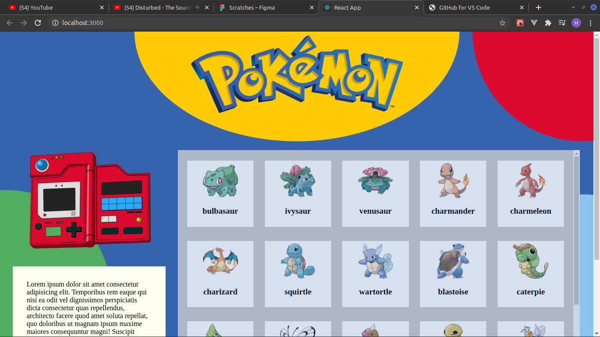
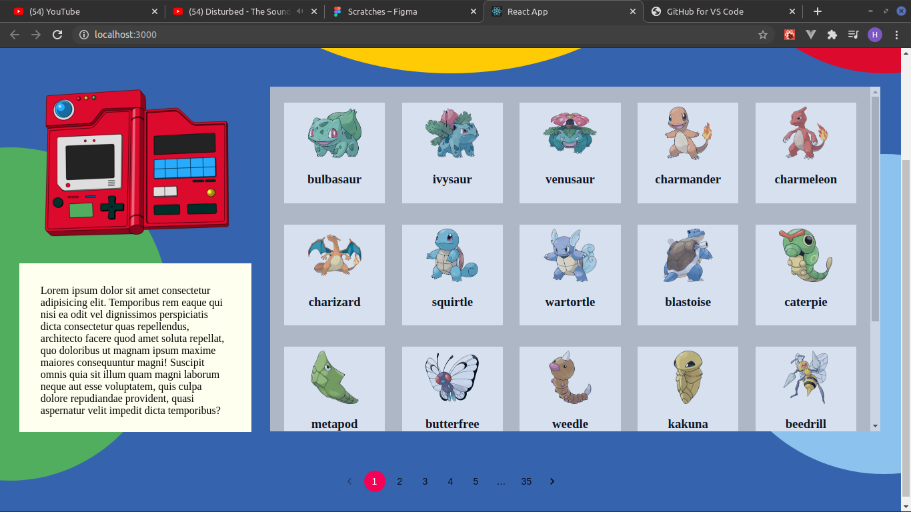

# poke-page

<p>
  A simple page created to practice pagination in ReactJS, integration
  with PokeAPI and the use of SVG and its positioning in the DOM.
</p>

# :computer: Web

<table style="width:100%">
  <tr>

  <td align="center"></td>

  <td align="center"></td>

  </tr>
</table>

# :computer: Technologies

This project was built using the follow technologies:

- [Typescript](https://www.typescriptlang.org/)
- [React](https://reactjs.org/)
- [PokeAPI](https://pokeapi.co/)

# :red_circle: Visit the page:

https://poke-page-ltp86vo6j.vercel.app/

# :construction_worker: How to run locally

```bash
# Clone Repository
$ git clone https://github.com/hercules-sousa/poke-page.git
```

### 💻 Running

```bash
# Go to web folder
$ cd poke-page

# Install Dependencies
$ yarn install

# Run Aplication
$ yarn start
```
